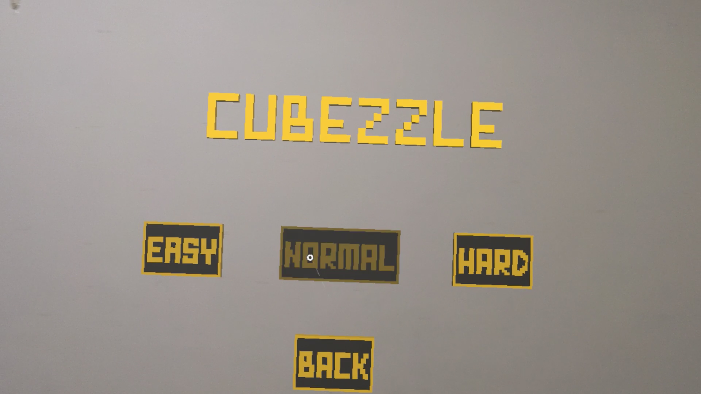
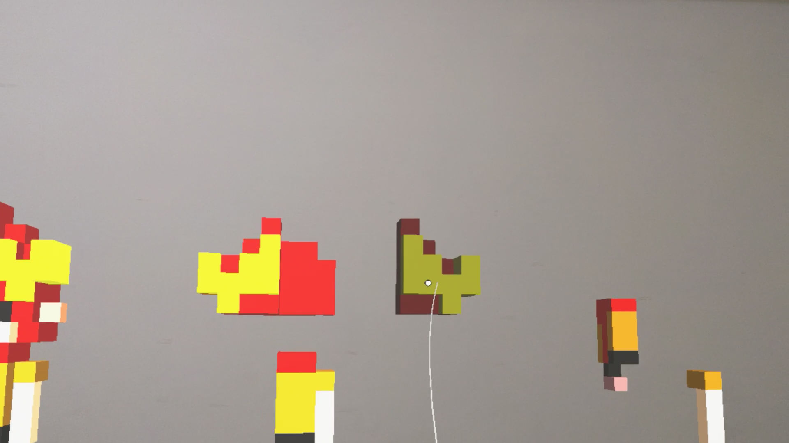
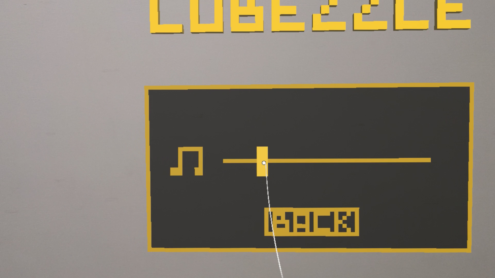
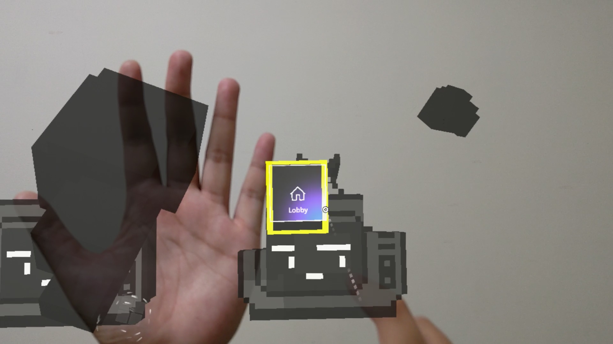
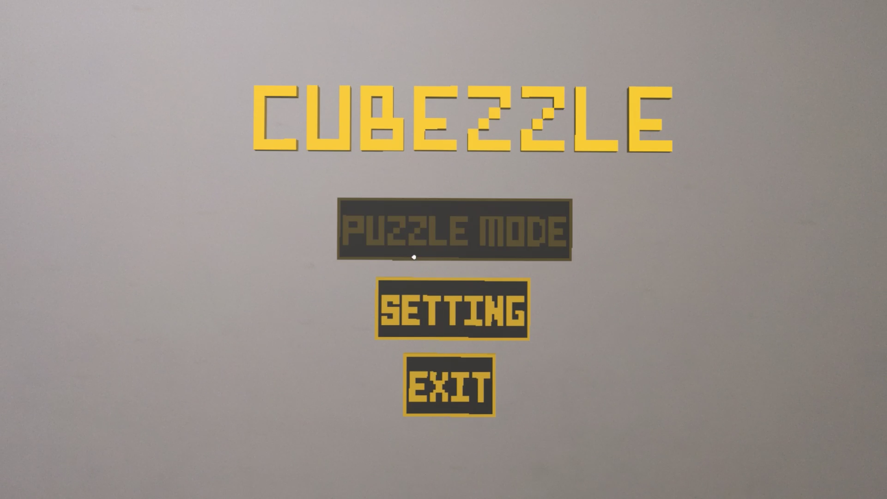

<h1 style="font-size: 28px;">Cubzzle - Hololens 互動拼圖小遊戲</h1>

Cubzzle 是一款以 Unity 與 Hololens 製作的 MR（混合實境）立體拼圖小遊戲，使用者可透過空間定位與手勢操作，將散落的拼圖塊吸附回正確位置與角度，體驗空間中的互動組合與解謎樂趣。

<h2>執行平台</h2>

本遊戲僅提供HoloLens上運行。

<h2 style="font-size: 20px;">系統畫面展示</h2>

<h3 style="font-size: 16px;">遊戲畫面</h3>
<table>
  <tr>
    <td></td>
    <td></td>
  </tr>
  <tr>
    <td></td>
    <td></td>
  </tr>
</table>

<h3 style="font-size: 16px;">展示影片</h3>

點擊圖片觀看展示影片

<h2>專案技術</h2>

本專案為 Hololens MR 應用開發練習作品，展示以下能力：

<ul>
  <li>Unity 結合 MRTK 製作 Hololens 應用</li>
  <li>多拼圖主題切換與隨機散佈</li>
  <li>自動吸附與旋轉對齊邏輯實作</li>
  <li>空間物件操作與互動體驗設計</li>
</ul>

<h2>操作方式</h2>
<ol>
  <li>進入場景後，會看到數個隨機散落的拼圖塊</li>
  <li>使用者可透過 Hololens 的手部操作將拼圖塊移動、旋轉</li>
  <li>當拼圖塊的位置與角度達到設定閾值時，會自動吸附到正確位置與朝向</li>
</ol>

<h2>開發工具</h2>
<ul>
  <li>Unity 2019.4.3f1</li>
  <li>MRTK（Mixed Reality Toolkit）</li>
  <li>C# / Unity API</li>
  <li>HoloLens</li>
</ul>

<h2>專案結構說明</h2>
<ul>
  <li><strong>PuzzleManager.cs</strong>：核心控制腳本，負責偵測拼圖塊與吸附邏輯。新增關卡主題時只需擴充enum，即可套用對應位置與旋轉初始化設定。</li>
  <li>可透過 Inspector 設定主題、吸附距離與旋轉容差值</li>
  <li>每個主題可指定不同拼圖初始化範圍與行為</li>
</ul>

<h2>⚠️ 注意事項</h2>
<ul>
  <li>吸附判斷使用距離 <code>Vector3.Distance</code> 與角度 <code>Quaternion.Angle</code>，建議閾值分別為 <strong>0.3~0.7f</strong>（位置）與 <strong>15~30°</strong>（旋轉）</li>
  <li>請確保拼圖物件 pivot 點位置正確，否則會導致旋轉吸附異常</li>
</ul>
